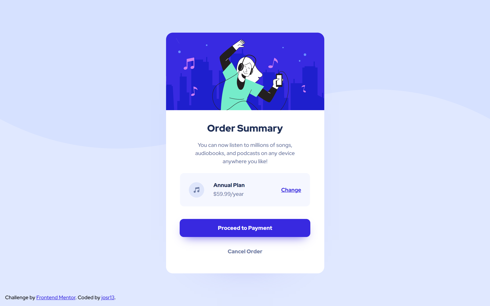

# Order summary component

This is my solution to the [Order summary component challenge on Frontend Mentor](https://www.frontendmentor.io/challenges/order-summary-component-QlPmajDUj). Frontend Mentor challenges help you improve your coding skills by building realistic projects. 

## Table of contents

- [Overview](#overview)
  - [Screenshot](#screenshot)
  - [Links](#links)
- [My process](#my-process)
  - [Built with](#built-with)
  - [What I learned](#what-i-learned)
- [Author](#author)

## Overview

### Screenshot



### Links

- Solution URL: [Frontend Mentor](https://www.frontendmentor.io/solutions/responsive-order-summary-component-using-flexbox-and-sass-FCk0Ag2cLZ)
- Live Site URL: [GitHub Pages](https://josr13.github.io/order-summary-component)

## My process

### Built with

- Semantic HTML5 markup
- Sass
- Flexbox
- Mobile-first workflow


### What I learned

While working through this project, I learned Sass' partials and @import. 

```css
@import 'variables';

:root {
    font-family: $font-stack;
    background-color: $pale-blue;
}
```

## Author

- Website - [Joseph](https://josr13.github.io)
- Frontend Mentor - [@josr13](https://www.frontendmentor.io/profile/josr13)
